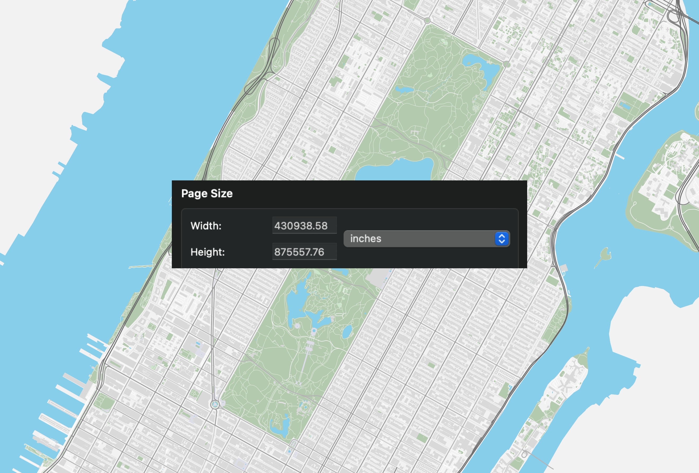

# PDF Map Generator

A Python application for generating 1:1 scale PDF maps from OpenStreetMap PBF Files.



## Prerequisites

- Python 3.13+
- [uv](https://docs.astral.sh/uv/getting-started/installation/)

## Quickstart

Create/activate venv and install dependencies.

```bash
uv venv
uv source .venv/bin/activate
uv sync
```

Adjust [config.py](config.py)

```python
# This example config will generate a map of Manhattan
CONFIG: MapConfig = MapConfig(
    pbf_file="manhattan-bounded.osm.pbf",
    bbox_bottom_left_coord=(40.68, -74.03),  # (Latitude, Longitude)
    bbox_top_right_coord=(40.88, -73.90),  # (Latitude, Longitude)
    boundary_relation_id=8398124,
)
```

Run the script

```python
python3 generate_pdf_map.py
```

## Configuration

Edit [config.py](config.py) file to configure your map:

- `PBF_FILE`: Path to your OpenStreetMap PBF file
  - You can download these files from places like [Geofabrik](https://download.geofabrik.de)
- `BBOX_BOTTOM_LEFT_COORD` and `BBOX_TOP_RIGHT_COORD`: Latitude/longitude coordinates defining the map area that is rendered
- `BOUNDARY_RELATION_ID`: Optional OSM relation ID to use as a boundary. If left blank, then everything inside of the bounding box will be rendered
  - As an example, [8398124 is the relation ID for the burough of Manhattan](https://www.openstreetmap.org/relation/8398124#map=12/40.7808/-73.9770&layers=N)

## Usage

Run the main script to generate your map:

```
python3 generate_pdf_map.py
```

The generated PDF will be saved in the `maps/` directory with a timestamp in the filename.

## Performance Optimization

> **⚠️ Tip for Large Maps**: For better performance when working with large OSM files, consider pre-extracting a slightly larger area than your target rendering region using [osmium extract](https://docs.osmcode.org/osmium/latest/osmium-extract.html). This can significantly reduce processing time.
>
> ```bash
> osmium extract -b LEFT,BOTTOM,RIGHT,TOP input.osm.pbf -o filtered.osm.pbf
> ```
>
> **Warning**: When pre-filtering, always ensure your extracted area is sufficiently larger than your final render area. If the boundaries are too close, coastlines and other boundary features may be cut off, resulting in unclosed polygons that can cause rendering failures or visual artifacts.

## How Do I View These PDFs?

Idk man, they kinda cause everything to jank out. I'd recommend the iOS webkit pdf viewer, it's the only one I've found that was able to render the map fully zoomed out and really zoomed in. Firefox also worked pretty well, but it would get blurry when zooming in.

## Project Structure

- `generate_pdf_map.py`: Main script that orchestrates the map generation process
- `config.py`: Configuration settings for the map
- `src/`: Core source code
  - `features/`: Handlers for different map features (roads, buildings, water, etc.)
  - `map_dimensions.py`: Calculates map dimensions and coordinates
  - `osm_handler.py`: Main OpenStreetMap data processor
  - `transforms.py`: Coordinate transformation utilities
  - `rendering.py`: PDF rendering functions

## Examples

The default configuration generates a map of Manhattan, but you can modify the settings to create maps for other areas by adjusting the configuration parameters.

## License

MIT License
